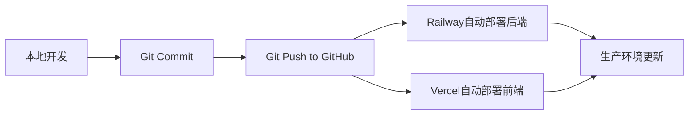

# 🚀 免费线上部署指南

本文档介绍如何将模型管理系统免费部署到互联网，让任何人都可以访问。

## 📋 推荐方案：Vercel + Railway

### 架构说明
```
用户访问
  ↓
Vercel (前端静态资源) - vercel.app
  ↓ API请求
Railway (后端Spring Boot + MySQL) - railway.app
```

### 为什么选择这个方案？
- ✅ **完全免费** - 个人项目无需付费
- ✅ **自动部署** - Git推送后自动构建部署
- ✅ **HTTPS支持** - 自动配置SSL证书
- ✅ **全球CDN** - Vercel提供全球加速
- ✅ **易于配置** - 图形化界面，无需复杂配置

---

## 🎯 第一步：准备GitHub仓库

### 1.1 创建GitHub仓库

1. 访问 https://github.com
2. 点击 "New repository"
3. 填写仓库信息：
   - Repository name: `model-management-system`
   - Description: `模型管理系统 - Vue3 + Spring Boot`
   - 选择 Public（公开）
4. 点击 "Create repository"

### 1.2 上传代码到GitHub

在你的项目根目录执行：

```bash
# 初始化Git（如果还没有）
git init

# 添加所有文件
git add .

# 提交
git commit -m "Initial commit: 模型管理系统"

# 关联远程仓库（替换为你的仓库地址）
git remote add origin https://github.com/你的用户名/model-management-system.git

# 推送到GitHub
git push -u origin main
```

**注意**: 在推送前，确保创建 `.gitignore` 文件，避免上传敏感信息。

### 1.3 创建 .gitignore 文件

在项目根目录创建 `.gitignore`：

```gitignore
# Java
backend/target/
backend/*.jar
backend/.mvn/
backend/mvnw
backend/mvnw.cmd

# Node
frontend/node_modules/
frontend/dist/
frontend/.vite/

# IDE
.idea/
.vscode/
*.iml

# 操作系统
.DS_Store
Thumbs.db

# 日志
*.log

# 环境变量
.env
.env.local
*.env

# 上传文件
backend/uploads/

# 数据库
*.sql
!backend/src/main/resources/db/migration/*.sql
```

---

## 💾 第二步：部署数据库（Railway）

### 2.1 注册Railway

1. 访问 https://railway.app
2. 点击 "Login" → "Sign in with GitHub"
3. 授权GitHub账号

### 2.2 创建MySQL数据库

1. 点击 "New Project"
2. 选择 "Deploy from template"
3. 搜索 "MySQL" 并选择
4. 或者点击 "Empty Project" 然后手动添加：
   - 点击 "+ New"
   - 选择 "Database" → "Add MySQL"

### 2.3 获取数据库连接信息

1. 点击 MySQL 服务
2. 进入 "Variables" 标签
3. 记录以下变量：
   - `MYSQLHOST` - 数据库主机
   - `MYSQLPORT` - 端口（通常是3306）
   - `MYSQLUSER` - 用户名
   - `MYSQLPASSWORD` - 密码
   - `MYSQLDATABASE` - 数据库名

### 2.4 初始化数据库表

**方法一：使用Railway CLI（推荐）**

```bash
# 安装Railway CLI
npm install -g @railway/cli

# 登录
railway login

# 连接到数据库
railway connect

# 在本地执行SQL文件
mysql -h 127.0.0.1 -P 3306 -u root -p model_management < backend/src/main/resources/db/migration/V1__add_user_table.sql
```

**方法二：使用在线MySQL客户端**

1. 下载 SQL 文件内容：`backend/src/main/resources/db/migration/V1__add_user_table.sql`
2. 使用工具如 DBeaver、Navicat 或 MySQL Workbench
3. 连接到Railway提供的MySQL
4. 执行SQL脚本

**方法三：通过Spring Boot自动建表**

配置Spring Boot的 `application.yml`，设置：
```yaml
spring:
  jpa:
    hibernate:
      ddl-auto: update
```

首次启动时会自动创建表结构。

---

## ⚙️ 第三步：部署后端（Railway）

### 3.1 创建后端服务

1. 在Railway项目中，点击 "+ New"
2. 选择 "GitHub Repo"
3. 选择你的仓库 `model-management-system`
4. Railway会自动检测到Java项目

### 3.2 配置环境变量

在后端服务的 "Variables" 标签中添加：

```properties
# 数据库配置（从第二步获取）
SPRING_DATASOURCE_URL=jdbc:mysql://${{MYSQLHOST}}:${{MYSQLPORT}}/${{MYSQLDATABASE}}?useUnicode=true&characterEncoding=utf8&serverTimezone=Asia/Shanghai&allowPublicKeyRetrieval=true&useSSL=false
SPRING_DATASOURCE_USERNAME=${{MYSQLUSER}}
SPRING_DATASOURCE_PASSWORD=${{MYSQLPASSWORD}}

# JWT配置
JWT_SECRET=mySecretKeyForJWTTokenGenerationAndValidation123456789
JWT_EXPIRATION=86400000

# 服务器端口（Railway会自动分配）
SERVER_PORT=${{PORT}}

# 文件上传路径
FILE_UPLOAD_PATH=/app/uploads/avatars
FILE_ACCESS_URL=https://你的后端域名.railway.app/uploads
```

**注意**: Railway会自动注入 `PORT` 和 `MYSQL*` 变量。

### 3.3 配置启动命令

在 "Settings" → "Build" 中确认：

- **Root Directory**: `backend`
- **Build Command**: `mvn clean package -DskipTests`
- **Start Command**: `java -jar target/management-1.0.0.jar`

### 3.4 触发部署

1. 推送代码到GitHub：
```bash
git add .
git commit -m "Deploy to Railway"
git push
```

2. Railway会自动检测并提交，开始构建部署

3. 等待部署完成（约3-5分钟）

4. 在 "Settings" → "Domains" 中获取后端域名，例如：
   ```
   https://model-management-production-xxxx.up.railway.app
   ```

### 3.5 验证后端

访问 Swagger UI 测试：
```
https://你的后端域名.railway.app/swagger-ui.html
```

应该能看到API文档页面。

---

## 🎨 第四步：部署前端（Vercel）

### 4.1 注册Vercel

1. 访问 https://vercel.com
2. 点击 "Sign Up" → "Continue with GitHub"
3. 授权GitHub账号

### 4.2 导入项目

1. 点击 "Add New..." → "Project"
2. 找到你的仓库 `model-management-system`
3. 点击 "Import"

### 4.3 配置构建选项

在配置页面：

- **Project Name**: `model-management-frontend`
- **Framework Preset**: `Vite`
- **Root Directory**: `frontend`
- **Build Command**: `npm run build`（默认）
- **Output Directory**: `dist`（默认）
- **Install Command**: `npm install`（默认）

### 4.4 配置环境变量

点击 "Environment Variables"，添加：

```properties
# 后端API地址（替换为你的Railway后端域名）
VITE_API_BASE_URL=https://你的后端域名.railway.app/api
```

**注意**: Vite的环境变量必须以 `VITE_` 开头。

### 4.5 修改前端代码以支持环境变量

编辑 `frontend/src/api/request.js`：

```javascript
import axios from 'axios'
import { ElMessage } from 'element-plus'

const request = axios.create({
  baseURL: import.meta.env.VITE_API_BASE_URL || '/api',
  timeout: 30000
})

// ... 其余代码保持不变
```

编辑 `frontend/vite.config.js`：

```javascript
import { defineConfig } from 'vite'
import vue from '@vitejs/plugin-vue'

export default defineConfig({
  plugins: [vue()],
  server: {
    port: 5173,
    proxy: {
      '/api': {
        target: 'http://localhost:8080',
        changeOrigin: true
      }
    }
  },
  build: {
    outDir: 'dist'
  }
})
```

### 4.6 部署

1. 点击 "Deploy"
2. 等待构建完成（约1-2分钟）
3. 部署成功后，会获得一个域名：
   ```
   https://model-management-frontend.vercel.app
   ```

### 4.7 验证前端

访问前端域名，应该能看到登录页面。

---

## 🔧 第五步：配置CORS跨域

由于前后端分离部署在不同域名，需要配置CORS。

### 后端CORS配置

编辑 `backend/src/main/java/com/model/management/config/CorsConfig.java`：

```java
package com.model.management.config;

import org.springframework.context.annotation.Configuration;
import org.springframework.web.servlet.config.annotation.CorsRegistry;
import org.springframework.web.servlet.config.annotation.WebMvcConfigurer;

@Configuration
public class CorsConfig implements WebMvcConfigurer {

    @Override
    public void addCorsMappings(CorsRegistry registry) {
        registry.addMapping("/**")
                .allowedOriginPatterns(
                    "http://localhost:5173",
                    "http://localhost:5174",
                    "http://127.0.0.1:5173",
                    "https://*.vercel.app",  // 允许所有Vercel域名
                    "https://你的前端域名.vercel.app"  // 你的具体域名
                )
                .allowedMethods("GET", "POST", "PUT", "DELETE", "OPTIONS", "HEAD")
                .allowedHeaders("*")
                .allowCredentials(true)
                .maxAge(3600);
    }
}
```

提交并推送代码：
```bash
git add .
git commit -m "Update CORS config for production"
git push
```

Railway会自动重新部署。

---

## 📝 第六步：初始化生产环境数据

### 6.1 创建管理员账号

通过Swagger UI或Postman调用注册接口：

```bash
POST https://你的后端域名.railway.app/api/auth/register
Content-Type: application/json

{
  "username": "admin",
  "password": "admin123",
  "confirmPassword": "admin123",
  "nickname": "管理员",
  "email": "admin@example.com"
}
```

### 6.2 或使用SQL直接插入

连接到Railway MySQL，执行：

```sql
-- 需要先通过应用注册生成BCrypt密码，或使用已知密码哈希
INSERT INTO user (username, password, nickname, email, status) 
VALUES ('admin', '$2a$10$N.zmdr9k7uOCQb376NoUnuTJ8iAt6Z5EHsM8lE9lBOsl7iKTVKIUi', '管理员', 'admin@example.com', 1);
```

---

## ✅ 第七步：测试完整流程

### 7.1 访问前端

打开浏览器访问：
```
https://你的前端域名.vercel.app
```

### 7.2 登录测试

使用注册的admin账号登录：
- 用户名: admin
- 密码: admin123

### 7.3 功能测试

- ✅ 创建模型
- ✅ 创建工具
- ✅ 查看统计数据
- ✅ 上传头像
- ✅ 修改个人信息

---

## 🔄 持续部署

### 自动部署流程



每次推送到GitHub的main分支，都会自动触发：
1. Railway重新构建部署后端
2. Vercel重新构建部署前端

### 手动触发部署

**Railway**:
1. 进入项目页面
2. 点击 "Deployments"
3. 点击 "Redeploy"

**Vercel**:
1. 进入项目页面
2. 点击 "Deployments"
3. 点击 "Redeploy"

---

## 🌐 自定义域名（可选）

### Vercel自定义域名

1. 进入Vercel项目 → "Settings" → "Domains"
2. 输入你的域名，如 `model.yourdomain.com`
3. 按照提示配置DNS记录（CNAME）
4. 等待DNS生效（最多48小时）

### Railway自定义域名

1. 进入Railway服务 → "Settings" → "Domains"
2. 点击 "Generate Domain" 或使用自定义域名
3. 配置DNS记录

---

## ⚠️ 注意事项

### 1. Railway休眠机制

**问题**: Railway免费版项目在15分钟无访问后会休眠

**解决方案**:
- 使用免费监控服务定期访问保持活跃
- 推荐工具: UptimeRobot (https://uptimerobot.com)
  - 注册账号
  - 添加监控URL: `https://你的后端域名.railway.app/api/statistics/overview`
  - 设置5分钟检查一次

### 2. 文件大小限制

- Vercel: 单个文件最大50MB
- Railway: 磁盘空间最大5GB

### 3. 数据库备份

定期备份Railway数据库：
```bash
railway backup create
```

### 4. 日志查看

**Railway日志**:
- 进入服务 → "Deployments" → 点击最新部署 → "View Logs"

**Vercel日志**:
- 进入项目 → "Deployments" → 点击最新部署 → "View Build Logs"

---

## 🆘 常见问题

### Q1: 前端无法连接后端

**原因**: CORS配置错误或API地址配置错误

**解决**:
1. 检查浏览器控制台错误信息
2. 确认 `VITE_API_BASE_URL` 环境变量正确
3. 确认后端CORS配置包含前端域名
4. 清除浏览器缓存

### Q2: 后端启动失败

**原因**: 数据库连接失败或配置错误

**解决**:
1. 查看Railway日志
2. 确认数据库环境变量正确
3. 确认数据库已初始化
4. 检查数据库是否在运行

### Q3: 图片上传后无法访问

**原因**: 静态资源配置问题

**解决**:
1. 确认 `FILE_ACCESS_URL` 配置正确
2. 检查WebConfig静态资源映射
3. 确认uploads目录权限

### Q4: Railway项目休眠

**原因**: 15分钟无访问

**解决**:
- 使用UptimeRobot等监控服务保持活跃
- 或升级到Railway付费计划

### Q5: Vercel构建失败

**原因**: 依赖安装失败或构建错误

**解决**:
1. 查看构建日志
2. 确认 `package.json` 正确
3. 确认Node版本兼容
4. 尝试本地构建测试

---

## 💰 免费额度说明

### Vercel
- ✅ 无限个人项目
- ✅ 每月100GB带宽
- ✅ 自动HTTPS
- ✅ 全球CDN

### Railway
- ✅ 每月$5信用额度（足够个人项目）
- ✅ MySQL数据库
- ✅ 自动休眠（可保持活跃）
- ✅ 5GB磁盘空间

### 总成本: $0/月 🎉

---

## 📞 技术支持

如遇到问题：
1. 查看平台日志（Railway/Vercel）
2. 检查浏览器控制台错误
3. 查阅官方文档
4. 搜索GitHub Issues

---

## 🎉 完成！

现在你的模型管理系统已经成功部署到互联网，可以通过以下地址访问：

- **前端**: https://你的前端域名.vercel.app
- **后端**: https://你的后端域名.railway.app
- **Swagger**: https://你的后端域名.railway.app/swagger-ui.html

分享给你的朋友使用吧！🚀

---

**最后更新**: 2026-05-27
